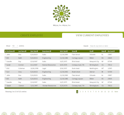

[](https://fr.reactjs.org/)
[](https://reactrouter.com/)
[](https://create-react-app.dev/)

# P14 - WealthHealth - Front-end data management

[](./hp_vignette.png)](https://peanuts-83.github.io/P14-wealth_health/)
[](./Slide_P14.pdf) - SlideShow

&nbsp;

## Project's presentation

*You work for the technology department of a large financial company, WealthHealth.
This company uses an internal web application, called HRnet, which manages employee records. The app is old and uses jQuery on the front end, which leads to massive bugs and increased internal complaints. Your development team has been struggling for some time now to upgrade the app.*

**This project has three main objectives:**

* Create a front-end data management interface with the React framework.
* Convert old jQuery plugins to modern React components.
* Create an installable npm library from a React component and make it available on the npmjs.com repository.

&nbsp;

## FRONT-END setup

Any package manager such as npm or yarn is required.

* You have to clone the project locally with either/or :

```bash
# HTTPS
 git clone https://github.com/Peanuts-83/P14-wealth_health.git


# SSH
git clone git@github.com:Peanuts-83/P14-wealth_health.git
```

* Then access inside your local repository and install dependencies using :

```bash
npm install
```

* Launch the application with :

```bash
 npm start
 ```

&nbsp;

## USE the application

The data is prefilled by default in order to make use of all the functionalities of the application. A **native React Context Store** is used here, and localStorage is used to avoid loss of data on user refresh. The final application should store data in online database anyway...

You can create new Employees in the *Create section*.

The dynamic table in the *View section* enables sorting and searching employees by any existing element.
It is also possible to choose the length of the displayed results, or click dynamic pagination at the bottom of the table.

&nbsp;

## URL/PORT

The default URL used by the application is <http://localhost:3000>.

&nbsp;

# Getting Started with Create React App

This project was bootstrapped with [Create React App](https://github.com/facebook/create-react-app).

## Available Scripts

In the project directory, you can run:

### `npm start`

Runs the app in the development mode.\
Open [http://localhost:3000](http://localhost:3000) to view it in your browser.

The page will reload when you make changes.\
You may also see any lint errors in the console.

### `npm test`

Launches the test runner in the interactive watch mode.\
See the section about [running tests](https://facebook.github.io/create-react-app/docs/running-tests) for more information.

### `npm run build`

Builds the app for production to the `build` folder.\
It correctly bundles React in production mode and optimizes the build for the best performance.

The build is minified and the filenames include the hashes.\
Your app is ready to be deployed!

See the section about [deployment](https://facebook.github.io/create-react-app/docs/deployment) for more information.

### `npm run eject`

**Note: this is a one-way operation. Once you `eject`, you can't go back!**

If you aren't satisfied with the build tool and configuration choices, you can `eject` at any time. This command will remove the single build dependency from your project.

Instead, it will copy all the configuration files and the transitive dependencies (webpack, Babel, ESLint, etc) right into your project so you have full control over them. All of the commands except `eject` will still work, but they will point to the copied scripts so you can tweak them. At this point you're on your own.

You don't have to ever use `eject`. The curated feature set is suitable for small and middle deployments, and you shouldn't feel obligated to use this feature. However we understand that this tool wouldn't be useful if you couldn't customize it when you are ready for it.

## Learn More

You can learn more in the [Create React App documentation](https://facebook.github.io/create-react-app/docs/getting-started).

To learn React, check out the [React documentation](https://reactjs.org/).

### Code Splitting

This section has moved here: [https://facebook.github.io/create-react-app/docs/code-splitting](https://facebook.github.io/create-react-app/docs/code-splitting)

### Analyzing the Bundle Size

This section has moved here: [https://facebook.github.io/create-react-app/docs/analyzing-the-bundle-size](https://facebook.github.io/create-react-app/docs/analyzing-the-bundle-size)

### Making a Progressive Web App

This section has moved here: [https://facebook.github.io/create-react-app/docs/making-a-progressive-web-app](https://facebook.github.io/create-react-app/docs/making-a-progressive-web-app)

### Advanced Configuration

This section has moved here: [https://facebook.github.io/create-react-app/docs/advanced-configuration](https://facebook.github.io/create-react-app/docs/advanced-configuration)

### Deployment

This section has moved here: [https://facebook.github.io/create-react-app/docs/deployment](https://facebook.github.io/create-react-app/docs/deployment)

### `npm run build` fails to minify

This section has moved here: [https://facebook.github.io/create-react-app/docs/troubleshooting#npm-run-build-fails-to-minify](https://facebook.github.io/create-react-app/docs/troubleshooting#npm-run-build-fails-to-minify)
